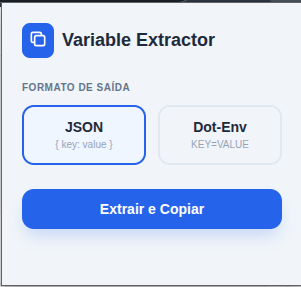

Aqui está um modelo de **README.md** caprichado, utilizando emojis, formatação clara e seções bem definidas para você colocar na pasta do seu projeto ou subir no GitHub.

---

# 🚀 Azure DevOps Variable Extractor

Uma extensão leve para Google Chrome (Manifest V3) que permite extrair rapidamente variáveis das tabelas do **Azure DevOps** (Library Groups ou Pipeline Variables) e copiá-las para a área de transferência em formatos prontos para uso.

---

<div align="center">



</div>


## 🛠️ O que ela faz?

Chega de copiar chave por chave manualmente! Com esta extensão, você pode capturar todas as variáveis visíveis na tela com um único clique e formatá-las como:

- **JSON:** Ideal para configurações de sistemas, scripts ou APIs.
- **Dot-Env (.env):** Perfeito para colar direto no seu arquivo de ambiente local e rodar aplicações.

---

## 📸 Funcionalidades

- [x] **Interface Intuitiva:** Popup simples para escolha de formato.
- [x] **Cópia Inteligente:** Remove espaços extras e formata os dados automaticamente.
- [x] **Feedback Visual:** Notificações rápidas no próprio popup confirmando o sucesso da extração.

---

## 📥 Como Instalar (Modo Desenvolvedor)

Como esta é uma extensão personalizada e não está na Chrome Web Store, siga estes passos simples para instalá-la:

1. **Baixe os arquivos:** Certifique-se de que os arquivos `manifest.json`, `popup.html` e `popup.js` estão todos na mesma pasta (ex: `extensao-azure-extractor`).
2. **Abra o Chrome:** Vá para o endereço `chrome://extensions/`.
3. **Ative o Modo do Desenvolvedor:** No canto superior direito, ative a chave **Modo do desenvolvedor**.
4. **Carregue a extensão:**

- Clique no botão **Carregar sem compactação** (Load unpacked).
- Selecione a pasta onde você salvou os arquivos da extensão.

5. **Fixe para facilitar:** Clique no ícone de quebra-cabeça (Extensões) ao lado da barra de endereços e "fixe" o Extrator de Variáveis para acesso rápido.

---

## 🚀 Como Usar

1. Acesse a página do **Azure DevOps** onde as variáveis estão listadas (ex: _Pipelines -> Library_).
2. Clique no ícone da extensão 🚀.
3. Selecione o formato desejado (**JSON** ou **Dot-Env**).
4. Clique em **Extrair e Copiar**.
5. Pronto! O conteúdo já está na sua área de transferência. É só dar um `Ctrl + V`.

---

## 📁 Estrutura do Projeto

```text
.
├── manifest.json    # Configurações e permissões da extensão
├── popup.html       # Interface visual (HTML/CSS)
└── popup.js         # Lógica de extração e formatação

```

---

## ⚖️ Licença

Este projeto é de uso livre. Sinta-se à vontade para modificar e adaptar conforme sua necessidade!

---

> **Dica:** Se as variáveis não forem detectadas, certifique-se de que a tabela está carregada na tela antes de clicar no botão de extração.
